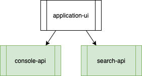

# application-ui [](https://travis-ci.com/stolostron/application-ui)
The UI service for Application Lifecycle

------

<!-- START doctoc generated TOC please keep comment here to allow auto update -->
<!-- DON'T EDIT THIS SECTION, INSTEAD RE-RUN doctoc TO UPDATE -->
**Table of Contents**  *generated with [DocToc](https://github.com/thlorenz/doctoc)*

  - [Work in Progress](#work-in-progress)
  - [Community, discussion, contribution, and support](#community-discussion-contribution-and-support)
  - [License](#license)
  - [Getting Started](#getting-started)
  - [Design](#design)
- [Setting up Your Dev Environment](#setting-up-your-dev-environment)
  - [Prerequiste Tools](#prerequiste-tools)
  - [Building for Development](#building-for-development)
  - [Running locally with an OKD cluster OCM environment](#running-locally-with-an-okd-cluster-ocm-environment)
  - [Building a local image](#building-a-local-image)
- [Testing](#testing)
- [NPM Commands](#npm-commands)
- [Links](#links)

<!-- END doctoc generated TOC please keep comment here to allow auto update -->

------

## Work in Progress
We are in the process of enabling this repo for community contribution. See wiki [here](https://open-cluster-management.io/concepts/architecture/).

## Community, discussion, contribution, and support

Check the [CONTRIBUTING Doc](CONTRIBUTING.md) for how to contribute to the repo.

## License

This project is licensed under the *Apache License 2.0*. A copy of the license can be found in [LICENSE](LICENSE).

Included fonts are licensed under the *SIL Open Font License 1.1*, and copies of this license can be found along side the corresponding fonts in the [./fonts](fonts) directory.

## Getting Started

The Application console runs only on the hub cluster. It defines the user interface used to create and manage application resources deployed on your managed clusters through the use of Application lifecycle subscription operators. This console component, application-ui, depends on the [console-api](https://github.com/stolostron/console-api) and [search-api](https://github.com/stolostron/search-api) components to work with the custom Kubernetes resources of the Application lifecycle model. The application-ui and console-api components are packaged as a Helm chart defined in the [application-chart](https://github.com/stolostron/application-chart) repository. The search-api component is packaged as a Helm chart defined in the [search-chart](https://github.com/stolostron/search-chart) repository. This is a guide on how to build and run stolostron application-ui.



## Design

This UI Platform is developed as an isomorphic react application.  The following major components are used to build this service.

* NodeJS
* Express
* React
* Handlebars
* Redux
* Webpack
* Babel
* Apollo/GraphQL
* Red Hat PatternFly
* Jest

# Setting up Your Dev Environment

## Prerequiste Tools
* [Git](https://git-scm.com/downloads)
* [Node](https://nodejs.org/en/download/) v12+
* [Docker](https://www.docker.com/products/docker-desktop) (Optional)

## Building for Development
<pre>
git clone https://github.com/stolostron/application-ui.git
cd application-ui
npm install
npm run build
</pre>


## Running locally with an OKD cluster OCM environment

By default the server runs in development mode using **insecure** HTTP connections. To use HTTPS, you must either:
- set the environment variables `serverKey` and `serverCert` with the full path of the key and certificate files
- provide a key and certificate in the `./sslcert/server.key` and `./sslcert/server.crt` files
- follow the README steps in ./sslcert to generate new certificate files

To run in production mode, set `NODE_ENV` to `production` and provide a key and certificate in `./certs/applicationui.key` and `./certs/applicationui.crt`.

To run your local `application-ui` code against an existing OCM installation:

1. Make sure you are logged in using `oc` then source the `setup-env.sh` script.
   ```
   . ./setup-env.sh
   ```
   This will automatically set up the redirect URL and export all required environment variables, allowing you to skip the next 2 steps. The variables are also printed out as JSON in case you prefer to set them up in a VS Code launch configuration as described below.

   The script works in `zsh` or `bash` and requires `oc` and `jq`.

   By default, the script sets the `hcmUiApiURL` variable to use the running OCM. To use local `console-api`, unset this variable.
   ```
   unset hcmUiApiUrl
   ```

2. Add your `application-ui` redirect link to your hub's oauthclient multicloudingress if it does not already exist there
   <pre>
   oc edit oauthclient multicloudingress -n open-cluster-management

   (Add "- http://localhost:3001/multicloud/applications/auth/callback" to "redirectURIs:" list)
   </pre>

3. The following environment variables need to be set.
   <pre>
   export OAUTH2_CLIENT_ID=
   export OAUTH2_CLIENT_SECRET=
   export OAUTH2_REDIRECT_URL=http://localhost:3001/multicloud/applications/auth/callback

   \# for local testing, from okd login token
   export API_SERVER_URL=
   export SERVICEACCT_TOKEN=
   export NODE_ENV=development

   \# search and console-api
   export searchApiUrl=`<OCMRouteEndpoint>/multicloud/applications/search/graphql`
   export hcmUiApiUrl=`<OCMRouteEndpoint>/multicloud/applications/graphql`
   </pre>

   For VS Code users, these variables can be set in your local VS Code enviroment using the launch.json in the .vscode directory. To create a launch.json file, open your project folder in VS Code (File > Open Folder) and then select the Configure gear icon on the Run view top bar.  If you go back to the File Explorer view (Ctrl+Shift+E), you'll see that VS Code has created a .vscode folder and added the launch.json file to your workspace.

   Use a map, `env:{}` , in launch.json to contain your environment variables.
   <pre>
   {
       "version": "0.2.0",
       "configurations": [
       {
           "type": "node",
           "request": "launch",
           "name": "",
           "program": "${workspaceFolder}/app.js",
           "env": {
           "hcmUiApiUrl": "http://localhost:4000/hcmuiapi",
           "searchApiUrl": "https://localhost:4010/searchapi",
           "NODE_ENV": "",
           "headerUrl": "",
           "OAUTH2_REDIRECT_URL": "http://localhost:3001/multicloud/applications/auth/callback",
           "OAUTH2_CLIENT_ID": "",
           "OAUTH2_CLIENT_SECRET": "",
           "SERVICEACCT_TOKEN": "",
           "API_SERVER_URL": "",
           }
       }
       ]
   }
   </pre>

4. If you are working on changes to `console-api`, run `console-api` locally following the instructions from https://github.com/stolostron/console-api

5. Start the server for production
   <pre>
   npm run start:production
   </pre>

6. Start the server for development, make sure to execute both of the following npm commands
   <pre>
   npm run build:watch
   npm run start
   </pre>

7. Open a browser to `https://localhost:3001/multicloud/applications` or `http://localhost:3001/multicloud/applications`, depending on whether you are using a certificate for HTTPS or not. If prompted for password, use your OKD credentials.

## Building a local image
<pre>
git clone https://github.com/stolostron/application-ui.git
cd application-ui
export export USE_VENDORIZED_BUILD_HARNESS=false
export COMPONENT_DOCKER_REPO=&lt;docker_repo&gt;
export COMPONENT_NAME=application-ui
export IMAGE_TAG=&lt;image_tag&gt;
make install
make build-prod
make lint
make prune
make build-image
</pre>

# Testing

The following will run all unit tests.

<pre>
npm run test:unit
</pre>

To run a particular test.

<pre>
npm run test:unit -- &lt;test_file&gt;

# for example
npm run test:unit -- ApplicationTopology.test.js
</pre>

# NPM Commands

The full list of npm scripts are described below.

| Command                          | Description                                                                                                                      |
|----------------------------------|----------------------------------------------------------------------------------------------------------------------------------|
| `npm start`                      | Starts the application with NODE_ENV='development'                                                                               |
| `npm run test:unit`                  | Runs jest tests                                                                                                                  |
| `npm run test:update-snapshot`       | Updates snapshots for jest tests. This command should only be used if you have made changes to a component that requires an updated snapshot artifact for a test case.|
| `npm run start:production`       | Starts the application with NODE_ENV='production'                                                                                |
| `npm run clean`                  | Deletes the generated files from public folder.                                                                                  |
| `npm run build`                  | Does a FULL development build.  (caching disabled and dev source maps)                                                           |
| `npm run build:production`       | Does a FULL production build.                                                                                                    |
| `npm run build:watch`            | Does a build of application code (w/o the DLL generation) and remains running in the background watching for changes.            |
| `npm run build:dll`              | Only re-builds the the vendor library component.                                                                                 |
| `npm run lint`                   | Runs linting on the code base.                                                                                                   |
| `npm run lint:fix`               | Attempts to fix any linting errors automatically.                                                                                |
| `npm run shrinkwrap:clean`       | Regenerates a clean `npm-shrinkwrap.json` - THIS COMMAND SHOULD ONLY BE USED IN EXTREME CIRCUMSTANCES.                           |

> Note: The build process leverages the Dll and DllReference plugins to extract out vendor plugins for faster build times and improved browser caching.  A separate bundle is created for 3rd-party client-side libraries.  The generated bundle is sourced (_public/dll.vendor.js_) along with its manifest (_vendor-manifest.json_).  If new client dependencies are added or existing versions of dependencies are updated this module needs be regenerated and recommitted back into source control via  `npm run build:dll`.

# Links

These are a few useful links that will help provide technical reference and best practices when developing for the platform.

- [temptifly](https://github.com/stolostron/temptifly)
- [ui-components](https://github.com/stolostron/ui-components)
- [PatternFly](https://www.patternfly.org)
- [Webpack](https://webpack.js.org)
- [React Docs](https://facebook.github.io/react/docs/hello-world.html)
- [Thinking in React](https://facebook.github.io/react/docs/thinking-in-react.html)
- [Redux](http://redux.js.org)
- [Structuring Redux State](https://hackernoon.com/avoiding-accidental-complexity-when-structuring-your-app-state-6e6d22ad5e2a)
- [React Best Practices](https://engineering.musefind.com/our-best-practices-for-writing-react-components-dec3eb5c3fc8)
- [Smart and Dumb Components](https://medium.com/@dan_abramov/smart-and-dumb-components-7ca2f9a7c7d0)
- [Redux Best Practices](https://medium.com/@kylpo/redux-best-practices-eef55a20cc72)
